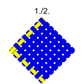
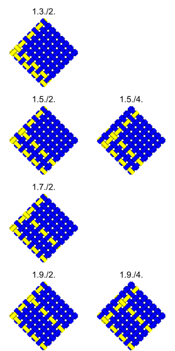
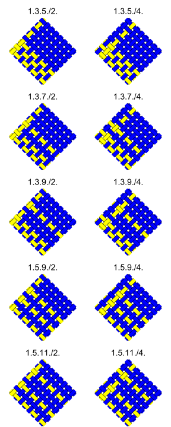
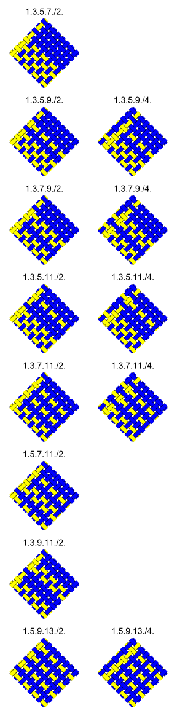
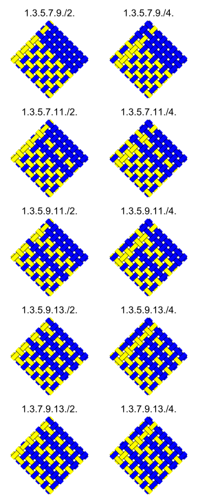
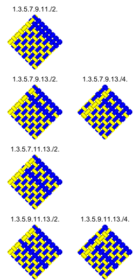
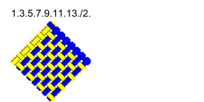

explanation ***

Table 2:  Inventory of patterns given by the Monster Theorem

||   |   | **even**| **thread**| **spots**| |
|:---:|:---:|:---:|:----:|:--------:|:------:|:---:|
|| |**0**| **4**  |  **8**    |**12**   | **16** |
||**0**|1|     |       |     |    |
||**4**|1|1|||||
||**8**|4|6|2|
|**odd**|**12**|5|10|34|29|
|**thread**|**16**|8|13|52|79|48|
|**spots**|**20**|5|10|34|29|
||**24**|4|6|12|
||**28**|1|1|
||**32**|1|

||   |   | **even**| **thread**| **spots**| |
|:---:|:---:|:---:|:----:|:--------:|:------:|:---:|
|| |**0**| **4**  |  **8**    |**12**   | **16** |
||**0**|1|     |       |     |    |
||**4**|1||||||
||**8**|4||2|
|**odd**|**12**|5||34|29|
|**thread**|**16**|8||52|79|48|
|**spots**|**20**|5||34|29|
||**24**|4||12|
||**28**|1||
||**32**|1|
